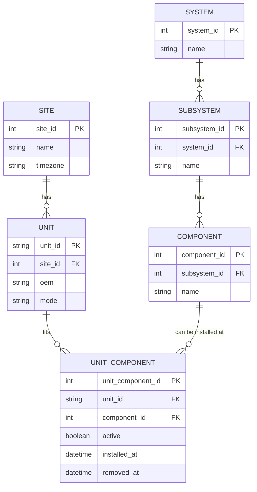
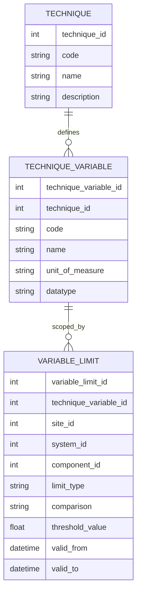
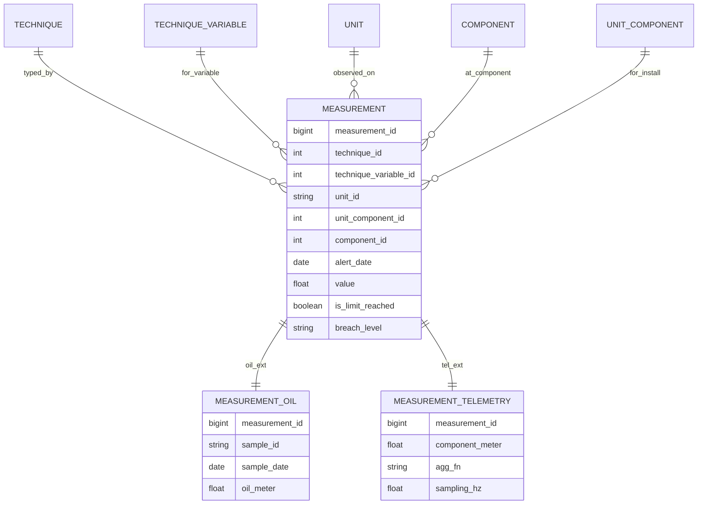
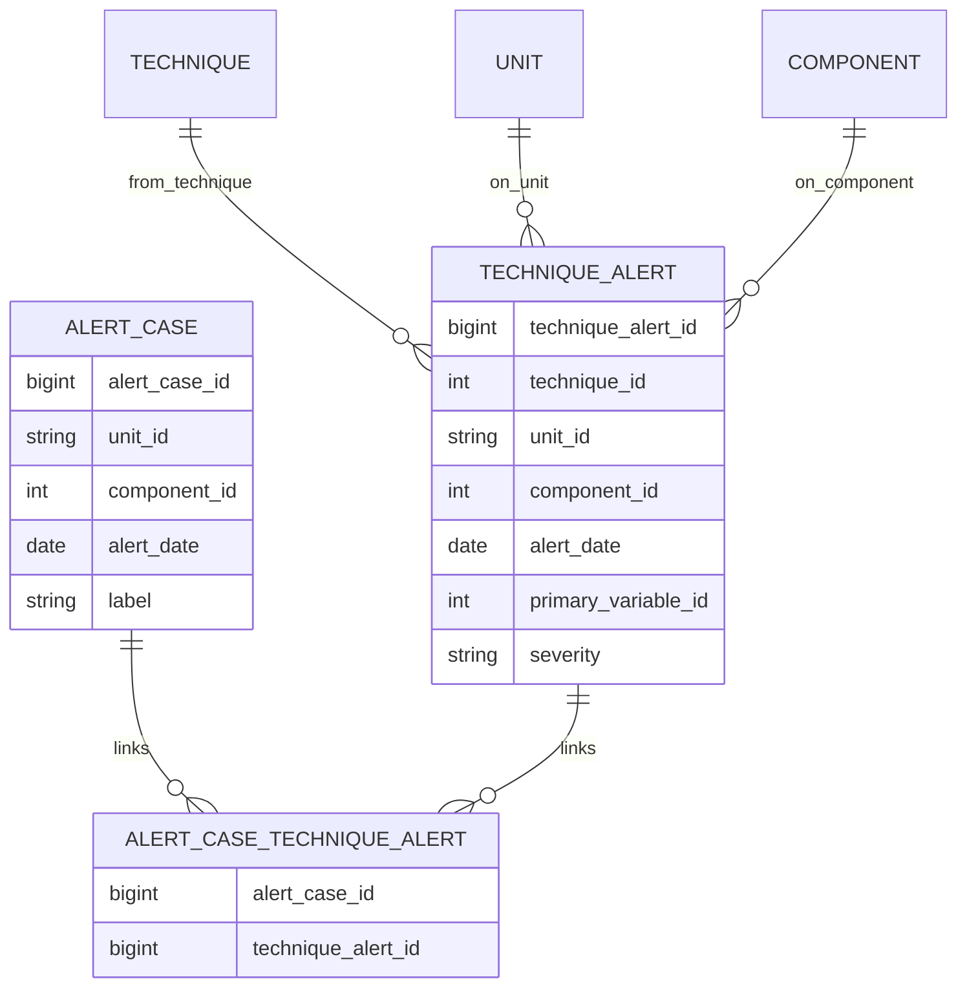
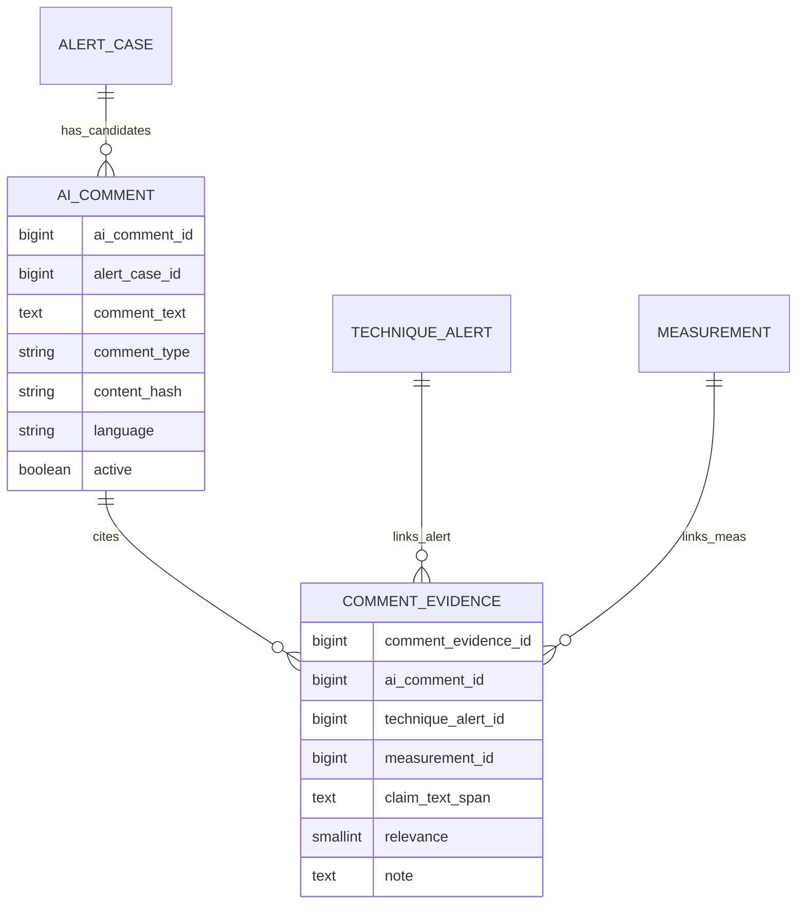
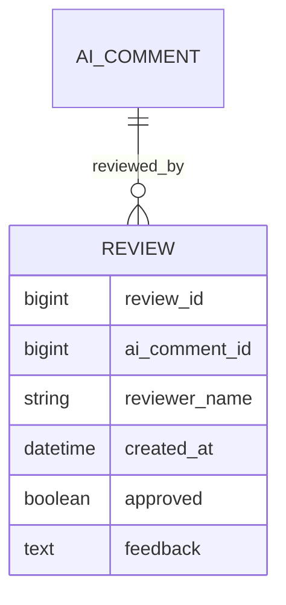

# AI Comment Review Platform — Data Model & Data Contracts

*Visually structured, copy-paste ready for `README.md`. Uses Mermaid for diagrams.*

---

## Contents

* [1. Domain Overview](#1-domain-overview)
* [2. Entity–Relationship (ER) Diagrams](#2-entityrelationship-er-diagrams)
    * [2.1 Assets](#21-assets)
    * [2.2 Technique Registry & Limits](#22-technique-registry--limits)
    * [2.3 Measurements (Supertype + Specializations)](#23-measurements-supertype--specializations)
    * [2.4 Alerts & Cases](#24-alerts--cases)
    * [2.5 AI Comments & Evidence](#25-ai-comments--evidence)
    * [2.6 Reviews](#26-reviews)
* [3. Data Contracts](#3-data-contracts)
    * [A. Technique & Variable Registry](#a-technique--variable-registry)
    * [B. Measurements Ingest](#b-measurements-ingest)
    * [C. Alerts & Cases](#c-alerts--cases)
    * [D. AI Comments & Evidence](#d-ai-comments--evidence)
    * [E. Reviews](#e-reviews)
* [4. Validation Rules (Quick Reference)](#4-validation-rules-quick-reference)
* [5. Partitioning & Retention](#5-partitioning--retention)

---

## 1. Domain Overview

> **Goal**: Grade AI-generated comments that summarize abnormal behavior on mining equipment (trucks), grounded in multi-technique evidence (e.g., Oil, Telemetry).

**Core ideas**

* **Assets**: `Unit → System → Subsystem → Component` (+ `UnitComponent` for install history).
* **Techniques**: Registry of techniques & variables; scoped **limits** (by site/system/component + time).
* **Measurements**: Unified **supertype** `measurement` with specializations for oil and telemetry.
* **TechniqueAlert**: Abnormality within one technique on a specific date.
* **AlertCase**: Cross-technique grouping for review.
* **AIComment**: Generated message per case; **CommentEvidence** links text to data.
* **Review**: Simple pass/fail evaluation.

---

## 2. Entity–Relationship (ER) Diagrams

### 2.1 Assets



---

### 2.2 Technique Registry & Limits



---

### 2.3 Measurements (Supertype + Specializations)



---

### 2.4 Alerts & Cases



---

### 2.5 AI Comments & Evidence



---

### 2.6 Reviews



---

## 3. Data Contracts

### A. Technique & Variable Registry

**`technique`**

| Column        | Type   | Req | Notes              |
| ------------- | ------ | :-: | ------------------ |
| `code`        | string |  ✔  | e.g., `OIL`, `TEL` |
| `name`        | string |  ✔  | Human-readable     |
| `description` | string |     |                    |

**`technique_variable`**

| Column            | Type   | Req | Notes                            |
| ----------------- | ------ | :-: | -------------------------------- |
| `technique_code`  | string |  ✔  | FK → `technique.code`            |
| `variable_code`   | string |  ✔  | e.g., `Fe`, `ISO`, `Temp_ENG_IN` |
| `name`            | string |  ✔  |                                  |
| `unit_of_measure` | string |     | e.g., `ppm`, `°C`                |
| `datatype`        | enum   |  ✔  | `float` | `int` | `categorical`  |

**`variable_limit`**

| Column            | Type     | Req | Notes                                                                     |
| ----------------- | -------- | :-: | ------------------------------------------------------------------------- |
| `technique_code`  | string   |  ✔  |                                                                           |
| `variable_code`   | string   |  ✔  |                                                                           |
| `site_id`         | int      |     | Scope (nullable)                                                          |
| `system_id`       | int      |     | Scope (nullable)                                                          |
| `component_id`    | int      |     | Scope (nullable)                                                          |
| `limit_type`      | enum     |  ✔  | `upper_marginal` | `upper_critical` | `lower_marginal` | `lower_critical` |
| `comparison`      | enum     |  ✔  | `>` `>=` `<` `<=`                                                         |
| `threshold_value` | number   |  ✔  |                                                                           |
| `valid_from`      | datetime |     | Versioning                                                                |
| `valid_to`        | datetime |     | Versioning                                                                |

---

### B. Measurements Ingest

**`oil_measurements.parquet`** → `measurement` + `measurement_oil`

| Column           | Type   | Req | Notes                                |       |          |         |
| ---------------- | ------ | :-: | ------------------------------------ | ----- | -------- | ------- |
| `AlertDate`      | date   |  ✔  | Date when alert was raised           |       |          |         |
| `UnitId`         | string |  ✔  | FK resolvable                        |       |          |         |
| `Component`      | string |  ✔  | Map to `component_id`                |       |          |         |
| `ElementName`    | string |  ✔  | FK → `technique_variable (OIL)`      |       |          |         |
| `Value`          | number |  ✔  |                                      |       |          |         |
| `OilMeter`       | number |     |                                      |       |          |         |
| `IsLimitReached` | bool   |     | Derivable                            |       |          |         |
| `BreachLevel`    | enum   |     | `none                                | alert | critical | urgent` |

**`telemetry_measurements.parquet`** → `measurement` + `measurement_telemetry`

| Column           | Type   | Req | Notes                           |
| ---------------- | ------ | :-: | ------------------------------- |
| `AlertDate`      | date   |  ✔  | Date when alert was raised      |
| `UnitId`         | string |  ✔  |                                 |
| `Component`      | string |  ✔  |                                 |
| `VariableName`   | string |  ✔  | FK → `technique_variable (TEL)` |
| `Value`          | number |  ✔  |                                 |
| `ComponentMeter` | number |     |                                 |
| `IsLimitReached` | bool   |     | Derivable                       |

---

### C. Alerts & Cases

**`technique_alert`**

| Column                  | Type   | Req | Notes             |
| ----------------------- | ------ | :-: | ----------------- |
| `technique_code`        | string |  ✔  |                   |
| `UnitId`                | string |  ✔  |                   |
| `Component`             | string |  ✔  |                   |
| `alert_date`            | date   |  ✔  |                   |
| `primary_variable_code` | string |     |                   |
| `severity`              | enum   |     | From site policy  |

**`alert_case`**

| Column        | Type   | Req | Notes              |                |          |            |
| ------------- | ------ | :-: | ------------------ | -------------- | -------- | ---------- |
| `AlertCaseId` | id     |  ✔  | Stable external id |                |          |            |
| `UnitId`      | string |  ✔  |                    |                |          |            |
| `Component`   | string |  ✔  |                    |                |          |            |
| `alert_date`  | date   |  ✔  |                    |                |          |            |
| `label`       | enum   |  ✔  | `oil_only          | telemetry_only | both     | multi`     |

**`alert_case_technique_alert`**

| Column             | Type | Req | Notes |
| ------------------ | ---- | :-: | ----- |
| `AlertCaseId`      | id   |  ✔  |       |
| `TechniqueAlertId` | id   |  ✔  |       |

---

### D. AI Comments & Evidence

**`ai_comments.parquet`**

| Column        | Type   | Req | Notes                                                    |    |      |
| ------------- | ------ | :-: | -------------------------------------------------------- | -- | ---- |
| `AICommentId` | id     |  ✔  |                                                          |    |      |
| `AlertCaseId` | id     |  ✔  |                                                          |    |      |
| `CommentText` | text   |  ✔  |                                                          |    |      |
| `CommentType` | enum   |  ✔  | e.g., `baseline`, `prompt_v2`, `rule_based`, `fewshot_A` |    |      |
| `language`    | string |     | `es                                                      | en | ...` |

**`comment_evidence`**

| Column             | Type | Req | Notes                    |
| ------------------ | ---- | :-: | ------------------------ |
| `AICommentId`      | id   |  ✔  |                          |
| `TechniqueAlertId` | id   |  ◐  | One of these is required |
| `MeasurementId`    | id   |  ◐  | One of these is required |
| `claim_text_span`  | text |     | Optional excerpt/offsets |
| `relevance`        | int  |     | 0..3                     |
| `note`             | text |     |                          |

---

### E. Reviews

**`review`**

| Column           | Type     | Req | Notes |
| ---------------- | -------- | :-: | ----- |
| `ReviewId`       | id       |  ✔  |       |
| `AICommentId`    | id       |  ✔  |       |
| `reviewer_name`  | string   |  ✔  |       |
| `created_at`     | datetime |  ✔  | UTC   |
| `approved`       | bool     |  ✔  |       |
| `feedback`       | text     |     |       |

---

## 4. Validation Rules (Quick Reference)

* **Registry first**: `(technique_code, variable_code)` must exist **before** any `variable_limit` or `measurement`.
* **Limit versioning**: No overlapping `[valid_from, valid_to)` for the same `(variable, scope, limit_type)`.
* **Scope resolution**: `Component` strings must resolve to `component_id`; store unresolved rows in a quarantine table.
* **Evidence linking**: `comment_evidence` must include **at least one** of `TechniqueAlertId` **or** `MeasurementId`.
* **Case integrity**: Every `ai_comment.alert_case_id` must have ≥1 linked `technique_alert` via junction.
* **Date consistency**: All `alert_date` fields within a case must match.

---

## 5. Partitioning & Retention

**Suggested lake partitions**

```
measurement/         site_id=XX/technique=OIL|TEL/yyy=YYYY/mm=MM/dd=DD/part-*.parquet
ai_comment/          yyy=YYYY/mm=MM/
review/              yyy=YYYY/mm=MM/
technique_alert/     yyy=YYYY/mm=MM/
alert_case/          yyy=YYYY/mm=MM/
```

**Retention**

* Raw telemetry: keep raw or aggregated windows per policy.
* Reviews: **indefinite** (audit trail).
* Limits: never delete; only **close** with `valid_to`.

---
