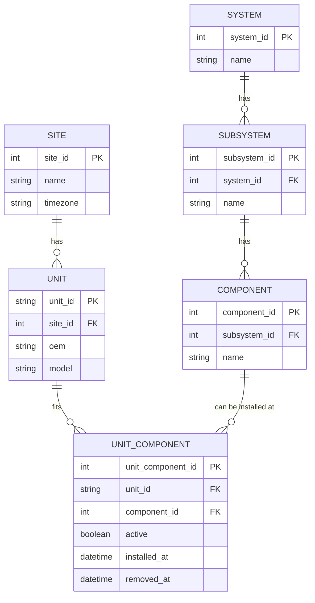
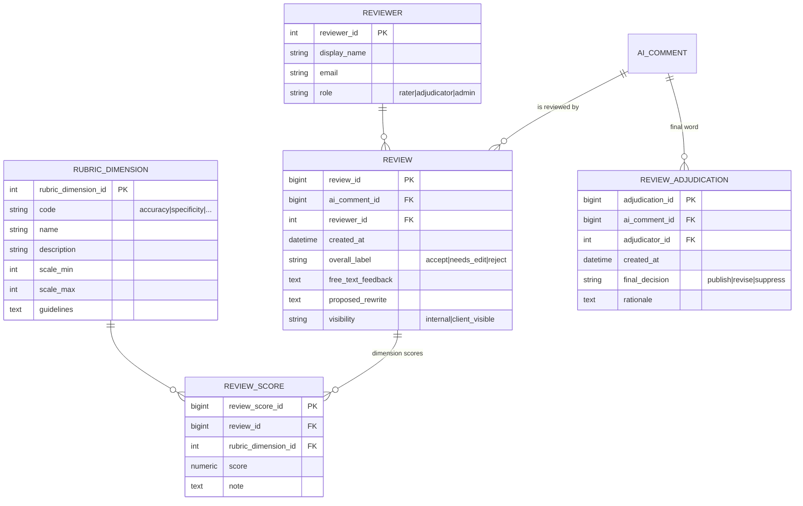

# AI Comment Review Platform — Data Model & Data Contracts

*Visually structured, copy-paste ready for `README.md`. Uses Mermaid for diagrams.*

---

## Contents

* [1. Domain Overview](#1-domain-overview)
* [2. Entity–Relationship (ER) Diagrams](#2-entityrelationship-er-diagrams)

  * [2.1 Assets](#21-assets)
  * [2.2 Technique Registry & Limits](#22-technique-registry--limits)
  * [2.3 Measurements (Supertype + Specializations)](#23-measurements-supertype--specializations)
  * [2.4 Alerts & Cases](#24-alerts--cases)
  * [2.5 AI Comments & Evidence](#25-ai-comments--evidence)
  * [2.6 Reviews & Rubrics](#26-reviews--rubrics)
* [3. Data Contracts](#3-data-contracts)

  * [A. Technique & Variable Registry](#a-technique--variable-registry)
  * [B. Measurements Ingest](#b-measurements-ingest)
  * [C. Alerts & Cases](#c-alerts--cases)
  * [D. AI Comments & Evidence](#d-ai-comments--evidence)
  * [E. Reviews](#e-reviews)
* [4. Validation Rules (Quick Reference)](#4-validation-rules-quick-reference)
* [5. Partitioning & Retention](#5-partitioning--retention)
* [6. Naming & Enums](#6-naming--enums)

---

## 1. Domain Overview

> **Goal**: Grade and curate AI-generated comments that summarize abnormal behavior on mining equipment (trucks), grounded in multi-technique evidence (e.g., Oil, Telemetry), with human review workflows.

**Core ideas**

* **Assets**: `Unit → System → Subsystem → Component` (+ `UnitComponent` for install history).
* **Techniques**: Registry of techniques & variables; scoped **limits** (by site/system/component + time).
* **Measurements**: Unified **supertype** `measurement` with specializations for oil and telemetry.
* **TechniqueAlert**: Abnormality within one technique.
* **AlertCase**: Cross-technique grouping for review.
* **AIComment**: Candidate message per case; **CommentEvidence** links text to data.
* **Review**: Multi-rater rubric scoring + adjudication.

---

## 2. Entity–Relationship (ER) Diagrams

> Tip: GitHub renders Mermaid. Keep each diagram near its section for readability.

### 2.1 Assets



---

### 2.2 Technique Registry & Limits

```mermaid
erDiagram
  TECHNIQUE ||--o{ TECHNIQUE_VARIABLE : "defines"
  TECHNIQUE_VARIABLE ||--o{ VARIABLE_LIMIT : "scoped limits"

  TECHNIQUE {
    int technique_id PK
    string code "OIL|TEL|..."
    string name
  }
  TECHNIQUE_VARIABLE {
    int technique_variable_id PK
    int technique_id FK
    string code
    string name
    string unit_of_measure
    string datatype "float|int|categorical"
  }
  VARIABLE_LIMIT {
    int variable_limit_id PK
    int technique_variable_id FK
    int site_id FK nullable
    int system_id FK nullable
    int component_id FK nullable
    string limit_type "upper_marginal|upper_critical|..."
    string comparison ">,>=,<,<="
    numeric threshold_value
    datetime valid_from
    datetime valid_to
  }
```

---

### 2.3 Measurements (Supertype + Specializations)

```mermaid
erDiagram
  TECHNIQUE ||--o{ MEASUREMENT : "typed by"
  TECHNIQUE_VARIABLE ||--o{ MEASUREMENT : "for variable"
  UNIT ||--o{ MEASUREMENT : "observed on"
  COMPONENT ||--o{ MEASUREMENT : "at component"
  UNIT_COMPONENT ||--o{ MEASUREMENT : "for install" 

  MEASUREMENT ||--|| MEASUREMENT_OIL : "1-0..1"
  MEASUREMENT ||--|| MEASUREMENT_TELEMETRY : "1-0..1"

  MEASUREMENT {
    bigint measurement_id PK
    int technique_id FK
    int technique_variable_id FK
    string unit_id FK
    int unit_component_id FK
    int component_id FK
    datetime ts
    datetime window_start nullable
    numeric value
    boolean is_limit_reached
    string breach_level nullable
  }
  MEASUREMENT_OIL {
    bigint measurement_id PK/FK
    string sample_id
    date sample_date
    numeric oil_meter
  }
  MEASUREMENT_TELEMETRY {
    bigint measurement_id PK/FK
    numeric component_meter
    string agg_fn "RAW|MEAN|P95|..."
    numeric sampling_hz
  }
```

> *Inheritance hint*: `MEASUREMENT` is the supertype. Oil/Telemetry add technique-specific fields (0..1 each).

---

### 2.4 Alerts & Cases

```mermaid
erDiagram
  TECHNIQUE ||--o{ TECHNIQUE_ALERT : "creates"
  UNIT ||--o{ TECHNIQUE_ALERT : ""
  COMPONENT ||--o{ TECHNIQUE_ALERT : ""
  ALERT_CASE ||--o{ ALERT_CASE_TECHNIQUE_ALERT : ""
  TECHNIQUE_ALERT ||--o{ ALERT_CASE_TECHNIQUE_ALERT : ""

  ALERT_CASE {
    bigint alert_case_id PK
    string unit_id FK
    int component_id FK
    datetime time_start
    string label "oil_only|telemetry_only|both|multi"
    string status "new|in_review|resolved|dismissed"
  }
  TECHNIQUE_ALERT {
    bigint technique_alert_id PK
    int technique_id FK
    string unit_id FK
    int component_id FK
    datetime start_ts
    datetime end_ts
    int primary_variable_id FK nullable
    string severity
    string state
  }
  ALERT_CASE_TECHNIQUE_ALERT {
    bigint alert_case_id FK
    bigint technique_alert_id FK
    PK "alert_case_id, technique_alert_id"
  }
```

---

### 2.5 AI Comments & Evidence

```mermaid
erDiagram
  ALERT_CASE ||--o{ AI_COMMENT : "has candidates"
  AI_COMMENT ||--o{ COMMENT_EVIDENCE : "cites"
  TECHNIQUE_ALERT ||--o{ COMMENT_EVIDENCE : "or links"
  MEASUREMENT ||--o{ COMMENT_EVIDENCE : "or links"

  AI_COMMENT {
    bigint ai_comment_id PK
    bigint alert_case_id FK
    text comment_text
    string comment_type
    char content_hash[64]
    string language
    boolean active
  }
  COMMENT_EVIDENCE {
    bigint comment_evidence_id PK
    bigint ai_comment_id FK
    bigint technique_alert_id FK nullable
    bigint measurement_id FK nullable
    datetime window_start nullable
    datetime window_end nullable
    text claim_text_span nullable
    smallint relevance "0..3"
    text note
  }
```

---

### 2.6 Reviews & Rubrics



---

## 3. Data Contracts

> **Format**: Each contract specifies required columns, types, and key validations. Designed for CSV/Parquet ingestion (idempotent upserts).

### A. Technique & Variable Registry

**`technique`**

| Column        | Type   | Req | Notes              |
| ------------- | ------ | :-: | ------------------ |
| `code`        | string |  ✔  | e.g., `OIL`, `TEL` |
| `name`        | string |  ✔  | Human-readable     |
| `description` | string |     |                    |

**`technique_variable`**

| Column            | Type   | Req | Notes                            |
| ----------------- | ------ | :-: | -------------------------------- |
| `technique_code`  | string |  ✔  | FK → `technique.code`            |
| `variable_code`   | string |  ✔  | e.g., `Fe`, `ISO`, `Temp_ENG_IN` |
| `name`            | string |  ✔  |                                  |
| `unit_of_measure` | string |     | e.g., `ppm`, `°C`                |
| `datatype`        | enum   |  ✔  | `float` | `int` | `categorical`  |
| `metadata`        | json   |     | Sampling notes                   |

**`variable_limit`**

| Column            | Type     | Req | Notes                                                                     |
| ----------------- | -------- | :-: | ------------------------------------------------------------------------- |
| `technique_code`  | string   |  ✔  |                                                                           |
| `variable_code`   | string   |  ✔  |                                                                           |
| `site_id`         | int      |     | Scope (nullable)                                                          |
| `system_id`       | int      |     | Scope (nullable)                                                          |
| `component_id`    | int      |     | Scope (nullable)                                                          |
| `limit_type`      | enum     |  ✔  | `upper_marginal` | `upper_critical` | `lower_marginal` | `lower_critical` |
| `comparison`      | enum     |  ✔  | `>` `>=` `<` `<=`                                                         |
| `threshold_value` | number   |  ✔  |                                                                           |
| `valid_from`      | datetime |     | Versioning                                                                |
| `valid_to`        | datetime |     | Versioning                                                                |
| `metadata`        | json     |     | Conditional logic                                                         |

---

### B. Measurements Ingest

**`oil_measurements.parquet`** → `measurement` + `measurement_oil`

| Column           | Type          | Req | Notes                                |       |          |         |
| ---------------- | ------------- | :-: | ------------------------------------ | ----- | -------- | ------- |
| `SampleDate`     | date/datetime |  ✔  | UTC preferred                        |       |          |         |
| `UnitId`         | string        |  ✔  | FK resolvable                        |       |          |         |
| `Component`      | string        |  ✔  | Map to `component_id`                |       |          |         |
| `ElementName`    | string        |  ✔  | FK → `technique_variable (OIL)`      |       |          |         |
| `Value`          | number        |  ✔  |                                      |       |          |         |
| `OilMeter`       | number        |     |                                      |       |          |         |
| `IsLimitReached` | bool          |     | Derivable                            |       |          |         |
| `BreachLevel`    | enum          |     | `none                                | alert | critical | urgent` |
| `LimitValue`     | number        |     | legacy; keep in `metadata` if needed |       |          |         |

**`telemetry_measurements.parquet`** → `measurement` + `measurement_telemetry`

| Column            | Type     | Req | Notes                           |
| ----------------- | -------- | :-: | ------------------------------- |
| `Timestamp`       | datetime |  ✔  | UTC                             |
| `UnitId`          | string   |  ✔  |                                 |
| `Component`       | string   |  ✔  |                                 |
| `VariableName`    | string   |  ✔  | FK → `technique_variable (TEL)` |
| `Value`           | number   |  ✔  |                                 |
| `ComponentMeter`  | number   |     |                                 |
| `UpperLimitValue` | number   |     | legacy; prefer `variable_limit` |
| `LowerLimitValue` | number   |     | legacy; prefer `variable_limit` |
| `IsLimitReached`  | bool     |     | Derivable                       |

> **Normalization rule**: Limits should live in `variable_limit`. If source files include per-row limits, preserve them in `measurement.metadata` for traceability only.

---

### C. Alerts & Cases

**`technique_alert`**

| Column                  | Type     | Req | Notes             |            |         |
| ----------------------- | -------- | :-: | ----------------- | ---------- | ------- |
| `technique_code`        | string   |  ✔  |                   |            |         |
| `UnitId`                | string   |  ✔  |                   |            |         |
| `Component`             | string   |  ✔  |                   |            |         |
| `start_ts`              | datetime |  ✔  |                   |            |         |
| `end_ts`                | datetime |     |                   |            |         |
| `primary_variable_code` | string   |     |                   |            |         |
| `severity`              | enum     |     | From site policy  |            |         |
| `state`                 | enum     |     | `open             | monitoring | closed` |
| `metadata`              | json     |     | Detection details |            |         |

**`alert_case`**

| Column        | Type     | Req | Notes              |                |          |            |
| ------------- | -------- | :-: | ------------------ | -------------- | -------- | ---------- |
| `AlertCaseId` | id       |  ✔  | Stable external id |                |          |            |
| `UnitId`      | string   |  ✔  |                    |                |          |            |
| `Component`   | string   |  ✔  |                    |                |          |            |
| `time_start`  | datetime |  ✔  |                    |                |          |            |
| `label`       | enum     |  ✔  | `oil_only          | telemetry_only | both     | multi`     |
| `status`      | enum     |  ✔  | `new               | in_review      | resolved | dismissed` |
| `metadata`    | json     |     |                    |                |          |            |

**`alert_case_technique_alert`**

| Column             | Type | Req | Notes |
| ------------------ | ---- | :-: | ----- |
| `AlertCaseId`      | id   |  ✔  |       |
| `TechniqueAlertId` | id   |  ✔  |       |

---

### D. AI Comments & Evidence

**`ai_comments.parquet`**

| Column        | Type   | Req | Notes                                                    |    |      |
| ------------- | ------ | :-: | -------------------------------------------------------- | -- | ---- |
| `AICommentId` | id     |  ✔  |                                                          |    |      |
| `AlertCaseId` | id     |  ✔  |                                                          |    |      |
| `CommentText` | text   |  ✔  |                                                          |    |      |
| `CommentType` | enum   |  ✔  | e.g., `baseline`, `prompt_v2`, `rule_based`, `fewshot_A` |    |      |
| `language`    | string |     | `es                                                      | en | ...` |

**`comment_evidence`**

| Column             | Type     | Req | Notes                    |
| ------------------ | -------- | :-: | ------------------------ |
| `AICommentId`      | id       |  ✔  |                          |
| `TechniqueAlertId` | id       |  ◐  | One of these is required |
| `MeasurementId`    | id       |  ◐  | One of these is required |
| `window_start`     | datetime |     | For time spans           |
| `window_end`       | datetime |     |                          |
| `claim_text_span`  | text     |     | Optional excerpt/offsets |
| `relevance`        | smallint |     | 0..3                     |
| `note`             | text     |     |                          |

---

### E. Reviews

**`review`**

| Column                       | Type     | Req | Notes     |                 |         |
| ---------------------------- | -------- | :-: | --------- | --------------- | ------- |
| `ReviewId`                   | id       |  ✔  |           |                 |         |
| `AICommentId`                | id       |  ✔  |           |                 |         |
| `ReviewerExternalId`/`email` | string   |  ✔  |           |                 |         |
| `created_at`                 | datetime |  ✔  | UTC       |                 |         |
| `overall_label`              | enum     |  ✔  | `accept   | needs_edit      | reject` |
| `free_text_feedback`         | text     |     |           |                 |         |
| `proposed_rewrite`           | text     |     |           |                 |         |
| `visibility`                 | enum     |     | `internal | client_visible` |         |

**`review_score`**

| Column                  | Type       | Req | Notes                  |             |      |
| ----------------------- | ---------- | :-: | ---------------------- | ----------- | ---- |
| `ReviewId`              | id         |  ✔  |                        |             |      |
| `rubric_dimension_code` | string     |  ✔  | `accuracy              | specificity | ...` |
| `score`                 | number/int |  ✔  | Within dimension scale |             |      |
| `note`                  | text       |     |                        |             |      |

**`review_adjudication`** (optional)

| Column                  | Type     | Req | Notes    |        |           |
| ----------------------- | -------- | :-: | -------- | ------ | --------- |
| `AICommentId`           | id       |  ✔  |          |        |           |
| `AdjudicatorExternalId` | string   |  ✔  |          |        |           |
| `created_at`            | datetime |  ✔  |          |        |           |
| `final_decision`        | enum     |  ✔  | `publish | revise | suppress` |
| `rationale`             | text     |     |          |        |           |

---

## 4. Validation Rules (Quick Reference)

* **Registry first**: `(technique_code, variable_code)` must exist **before** any `variable_limit` or `measurement`.
* **Limit versioning**: No overlapping `[valid_from, valid_to)` for the same `(variable, scope, limit_type)`.
* **Scope resolution**: `Component` strings must resolve to `component_id`; store unresolved rows in a quarantine table.
* **Evidence linking**: `comment_evidence` must include **at least one** of `TechniqueAlertId` **or** `MeasurementId`.
* **Case integrity**: Every `ai_comment.alert_case_id` must have ≥1 linked `technique_alert` via junction.
* **Rubric bounds**: Each `review_score` must satisfy `scale_min ≤ score ≤ scale_max` for its dimension.
* **Time**: All datetimes are UTC; if source is local, include source TZ in `metadata` and convert on ingest.

---

## 5. Partitioning & Retention

**Suggested lake partitions**

```
measurement/         site_id=XX/technique=OIL|TEL/yyy=YYYY/mm=MM/dd=DD/part-*.parquet
ai_comment/          yyy=YYYY/mm=MM/
review/              yyy=YYYY/mm=MM/
technique_alert/     yyy=YYYY/mm=MM/
alert_case/          yyy=YYYY/mm=MM/
```

**Retention**

* Raw telemetry: keep raw or aggregated windows (e.g., 1m) per policy.
* Reviews & adjudications: **indefinite** (audit trail).
* Limits: never delete; only **close** with `valid_to`.

---

## 6. Naming & Enums

**Enums (suggested)**

* `breach_level`: `none | alert | critical | urgent`
* `alert_case.label`: `oil_only | telemetry_only | both | multi`
* `technique_alert.state`: `open | monitoring | closed`
* `alert_case.status`: `new | in_review | resolved | dismissed`
* `comment_type`: `baseline | prompt_v2 | rule_based | fewshot_A | fewshot_B`
* `review.overall_label`: `accept | needs_edit | reject`
* `review.visibility`: `internal | client_visible`
* `review_adjudication.final_decision`: `publish | revise | suppress`

**Conventions**

* Snake_case column names; singular table names for entities.
* All timestamps UTC; add `*_at` suffix for datetimes, `*_date` for calendar dates.
* JSON config/metadata fields are lowercase keys with hyphenless tokens.

---

### Bonus: Reviewer Flow (at a glance)

```mermaid
flowchart LR
  A[Technique Alerts] --> B[Alert Case (group)]
  B --> C[AI Comment(s)]
  C --> D[Comment Evidence\n(measurements/windows)]
  C --> E[Review(s)\nRubric scores]
  E --> F{Adjudication?}
  F -- yes --> G[Final Decision]
  F -- no --> H[Status per latest review]
```

